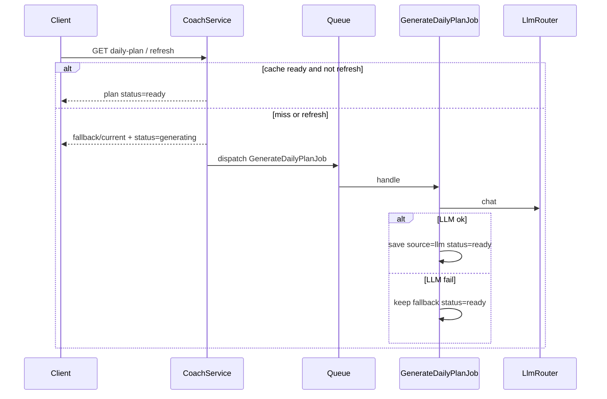

# Coach — дизайн / Design

**Languages:** [Русский](#русский) · [English](#english)

---

<a id="русский"></a>

## Русский

### Зона ответственности

Модуль **Coach** формирует **план на день** для пользователя: что учить, сколько времени выделить, какие шаги пройти. Не владеет онбордингом, контентом или практикой — **читает** профиль через публичный контракт Onboarding и **генерирует** план (LLM + детерминированный fallback).

### Режимы плана

| Режим | Условие | Поведение |
|-------|---------|-----------|
| `simplified` | Core не завершён **или** нет ни одного lite-пакета по включённым столпам | Приоритет: допройти онбординг, короткие шаги «explore» |
| `personalized` | Core + lite хотя бы по одному включённому столпу | Уроки, практика, mind-микро-практики по профилю |

Правило соответствует [onboarding.md](onboarding.md).

### Язык пользовательских строк

`interface_language` из core-анкеты (`facets.core`) задаёт язык **приветствия, шагов и reminder** плана.

- Fallback (`FallbackDailyPlanBuilder`) и reasons онбординга локализуются через `InterfaceLanguage`.
- LLM-путь получает жёсткое правило писать все user-facing поля на языке профиля; system prompt собирается из **всех** coach-фрагментов сессий (core + craft/mind/…), чтобы инструкция языка не терялась после `craft_lite`.
- Контент курсов (теория/упражнения) не локализуется автоматически.

Кэшированный план на день остаётся на старом языке до `?refresh=1`.

### API (v1)

```
GET /api/v1/coach/daily-plan
GET /api/v1/coach/daily-plan?date=2026-06-24
GET /api/v1/coach/daily-plan?refresh=1
```

**Auth:** `Bearer` (Sanctum).

HTTP **не ждёт LLM**. При первом запросе / `refresh=1` сразу отдаётся usable fallback (или текущий план), ставится `status=generating`, в очередь уходит `GenerateDailyPlanJob`. Повторный GET без refresh вернёт `ready` + `source=llm|fallback` когда job закончит.

**Ответ:**

```json
{
  "date": "2026-06-24",
  "mode": "simplified",
  "source": "fallback",
  "status": "generating",
  "message": "План готовится. Обновите через несколько секунд.",
  "total_minutes": 30,
  "greeting": "...",
  "steps": [
    {
      "type": "reflection",
      "title": "...",
      "description": "...",
      "minutes": 5,
      "prompts": ["..."],
      "tools": [{ "type": "notebook", "label": "..." }]
    }
  ],
  "reminders": [],
  "cached": false
}
```

| Поле | Описание |
|------|----------|
| `source` | `llm` / `fallback` |
| `status` | `ready` \| `generating` |
| `message` | Подсказка клиенту пока `generating` |
| `cached` | `true`, если строка уже была в `coach_daily_plans` |
| `refresh=1` | Пометить generating и поставить job (без ожидания LLM) |
| `check_in` | `null` или шкалы дня + `load_band` / `load_factor` |
| `steps[].prompts` | Вопросы для фиксации понимания |
| `steps[].tools` | CTA: `notebook`, `self_check`, `open_lesson`, `open_practice`, `check_in` |

### Daily check-in (без ИИ)

Фиксированные шкалы 1–5: `energy`, `focus`, `practice_ready`. Не клиника — только сигнал для объёма плана.

```
GET  /api/v1/coach/check-ins?date=2026-06-24
POST /api/v1/coach/check-ins
```

Пока чек-ина нет, в `daily-plan.steps[0]` отдаётся шаг `type=check_in` со `scales` и tool `check_in`. После POST план пересчитывается детерминированно от `plan_base`:

| `load_band` | avg шкал | Эффект |
|-------------|---------|--------|
| `low` | ≤ 2.33 | ×0.5 минут, practice/quiz убираются |
| `medium` | ≤ 3.5 | ×0.75 |
| `high` | выше | без урезания |

ИИ-опросники сюда не входят.

Дата плана считается в **timezone** из `user_profiles` (по умолчанию UTC).

### Поток данных



### Межмодульные границы

- Coach → Onboarding только через `OnboardingProfileReaderInterface` (ADR-0007).
- LLM только через `LlmRouter` + `LlmTask::DailyPlan` (ADR-0006).
- Кэш планов — таблица `coach_daily_plans`, уникальность `(user_id, plan_date)`, колонка `status`.
- Рефлексия в плане: `prompts`/`tools`; записи блокнота — модуль Journal (`type: notebook`).

### Структура модуля

```
app/Modules/Coach/
├── Contracts/DailyPlanRepositoryInterface.php
├── DTO/Input/GetDailyPlanData.php
├── DTO/Output/DailyPlanData.php
├── Enums/{PlanMode,PlanSource,PlanStepType,DailyPlanStatus}.php
├── Exceptions/CoachException.php
├── Http/Controllers/GetDailyPlanController.php
├── Http/Requests/GetDailyPlanRequest.php
├── Jobs/GenerateDailyPlanJob.php
├── Models/CoachDailyPlan.php
├── Providers/CoachServiceProvider.php
├── Repositories/DailyPlanRepository.php
├── Routes/v1.php
└── Services/
    ├── CoachService.php
    ├── DailyPlanGenerator.php
    └── FallbackDailyPlanBuilder.php
```

### Дальше

- Notifications: напоминания по `best_time_of_day` и незавершённым опросникам из `reminders`.
- LearningPath / Practice: реальные `lesson_id` и `exercise_id` в шагах плана.
- `POST /coach/daily-plan/steps/{id}/complete` — отметка выполнения.

---

<a id="english"></a>

## English

Coach `GET /api/v1/coach/daily-plan` never blocks on LLM. Cache hit → `status=ready`. Miss/`refresh=1` → immediate fallback (or current plan) + `status=generating` + queued `GenerateDailyPlanJob`. Job overwrites with `source=llm` or keeps fallback; always ends `ready`. Steps may include `prompts` and `tools` (e.g. notebook → Journal API). Until a fixed daily check-in is posted (`energy`/`focus`/`practice_ready`), response prepends a `check_in` step; POST `/coach/check-ins` adapts load from `plan_base` without AI. Languages and modes same as Russian section.
