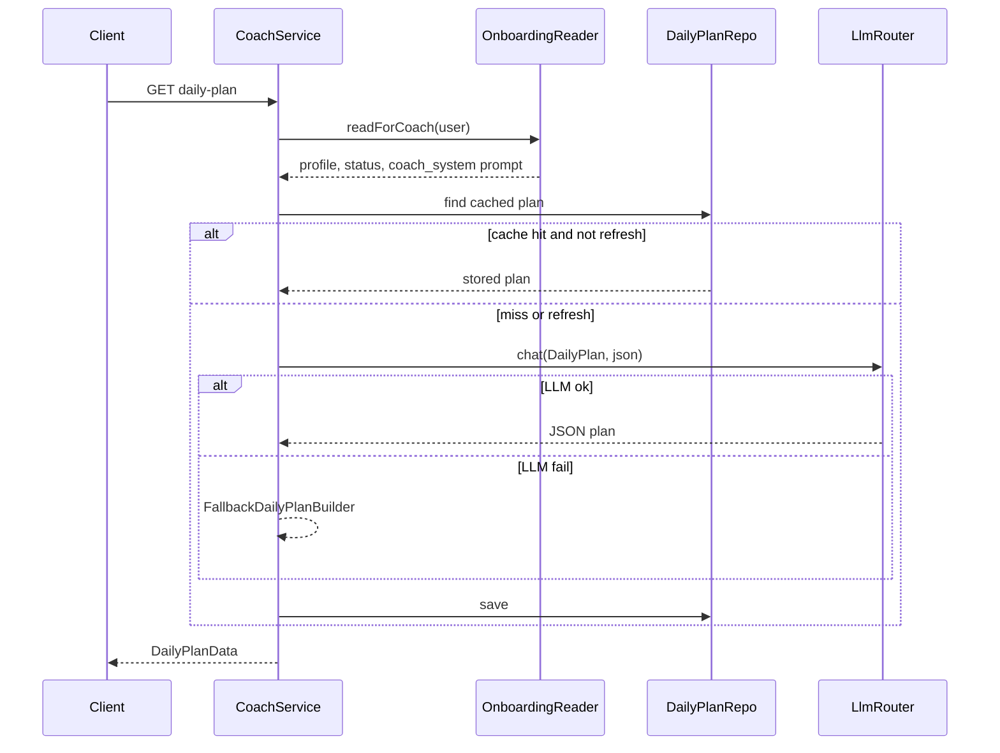

# Coach — дизайн / Design

**Languages:** [Русский](#русский) · [English](#english)

---

<a id="русский"></a>

## Русский

### Зона ответственности

Модуль **Coach** формирует **план на день** для пользователя: что учить, сколько времени выделить, какие шаги пройти. Не владеет онбордингом, контентом или практикой — **читает** профиль через публичный контракт Onboarding и **генерирует** план (LLM + детерминированный fallback).

### Режимы плана

| Режим | Условие | Поведение |
|-------|---------|-----------|
| `simplified` | Core не завершён **или** нет ни одного lite-пакета по включённым столпам | Приоритет: допройти онбординг, короткие шаги «explore» |
| `personalized` | Core + lite хотя бы по одному включённому столпу | Уроки, практика, mind-микро-практики по профилю |

Правило соответствует [onboarding.md](onboarding.md).

### API (v1)

```
GET /api/v1/coach/daily-plan
GET /api/v1/coach/daily-plan?date=2026-06-24
GET /api/v1/coach/daily-plan?refresh=1
```

**Auth:** `Bearer` (Sanctum).

**Ответ:**

```json
{
  "date": "2026-06-24",
  "mode": "simplified",
  "source": "llm",
  "total_minutes": 30,
  "greeting": "...",
  "steps": [
    {
      "type": "onboarding",
      "title": "...",
      "description": "...",
      "minutes": 15,
      "pillar": null,
      "questionnaire_code": "core"
    }
  ],
  "reminders": [
    {
      "type": "onboarding_incomplete",
      "questionnaire_code": "craft_lite",
      "required": true,
      "message": "..."
    }
  ],
  "cached": false
}
```

| Поле | Описание |
|------|----------|
| `source` | `llm` — от модели `LlmTask::DailyPlan`; `fallback` — правила без LLM |
| `cached` | `true`, если план взят из `coach_daily_plans` за этот день |
| `refresh=1` | Перегенерировать и перезаписать кэш |

Дата плана считается в **timezone** из `user_profiles` (по умолчанию UTC).

### Поток данных



### Межмодульные границы

- Coach → Onboarding только через `OnboardingProfileReaderInterface` (ADR-0007).
- LLM только через `LlmRouter` + `LlmTask::DailyPlan` (ADR-0006).
- Кэш планов — таблица `coach_daily_plans`, уникальность `(user_id, plan_date)`.

### Структура модуля

```
app/Modules/Coach/
├── Contracts/DailyPlanRepositoryInterface.php
├── DTO/Input/GetDailyPlanData.php
├── DTO/Output/DailyPlanData.php
├── Enums/{PlanMode,PlanSource,PlanStepType}.php
├── Exceptions/CoachException.php
├── Http/Controllers/GetDailyPlanController.php
├── Http/Requests/GetDailyPlanRequest.php
├── Models/CoachDailyPlan.php
├── Providers/CoachServiceProvider.php
├── Repositories/DailyPlanRepository.php
├── Routes/v1.php
└── Services/
    ├── CoachService.php
    ├── DailyPlanGenerator.php
    └── FallbackDailyPlanBuilder.php
```

### Дальше

- Notifications: напоминания по `best_time_of_day` и незавершённым опросникам из `reminders`.
- LearningPath / Practice: реальные `lesson_id` и `exercise_id` в шагах плана.
- `POST /coach/daily-plan/steps/{id}/complete` — отметка выполнения.

---

<a id="english"></a>

## English

Coach module exposes `GET /api/v1/coach/daily-plan`. It reads onboarding context via `OnboardingProfileReaderInterface`, caches one plan per user per calendar day (user timezone), generates via `LlmTask::DailyPlan` with deterministic fallback, and returns `simplified` vs `personalized` modes per onboarding completion rules.
